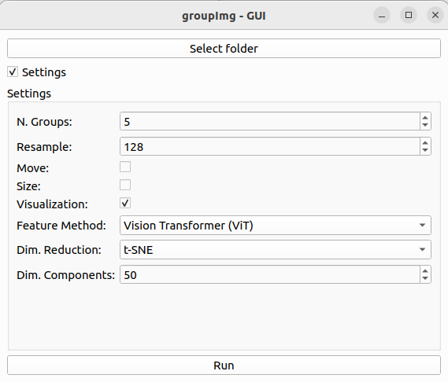
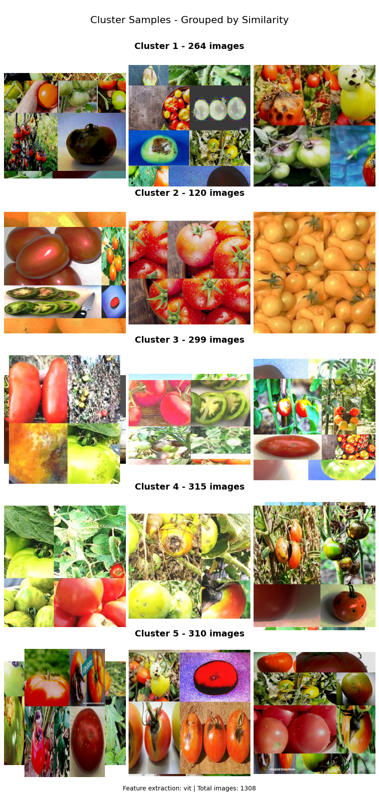

# AIgroupImg

A Python application to organize your images by similarity using AI-powered feature extraction and advanced machine learning techniques.

This project extends [groupImg](https://github.com/victorqribeiro/groupImg) with AI-powered feature extraction (using neural network encoders) and dimensionality reduction methods to improve clustering accuracy, especially for images with varying poses, rotations, and viewpoints.


## How to use

Navigate to the folder you want. CLI - Command Line Interface or GUI - Graphic User Interface

Install the requirements.txt

```
pip install -r requirements.txt
```

### CLI

Call the script passing the image folder you want to organize.

```
python groupimg.py -f /home/user/Pictures/
```

## Parameters

### Basic Parameters

\-f folder where your images are (use absolute path).

```bash
groupimg -f /home/user/Pictures
```


\-k number of folders you want to separate your images. 

```bash
groupimg -f /home/user/Pictures -k 5
```

\-m if you want to move your images instead of just copy them.

\-s if you want the algorithm to consider the size of the images as a feature.

### Advanced Parameters

\--feature select the feature extraction method (default: histogram)

```bash
groupimg -f /home/user/Pictures --feature swin
```

Available Feature Extraction Methods:

- `histogram`: Original histogram-based method (works with basic dependencies)  
- `vit`: Vision Transformer - powerful for general feature extraction  
- `swin`: Swin Transformer - excellent at capturing hierarchical features with varying receptive fields  
- `efficientnetv2`: EfficientNetV2 - state-of-the-art CNN architecture  

\--dim-reduction apply dimensionality reduction technique (default: None)

```bash
groupimg -f /home/user/Pictures --feature swin --dim-reduction pca
```

Available Dimensionality Reduction Methods:

- `pca`: Principal Component Analysis - linear dimensionality reduction  
- `tsne`: t-SNE - t-Distributed Stochastic Neighbor Embedding - nonlinear dimensionality reduction that preserves cluster structure  

\--dim-components number of components to reduce features to (default: 50)

```bash
groupimg -f /home/user/Pictures --feature swin --dim-reduction pca --dim-components 20
```

### Complete Example

```bash
python groupimg.py -f /home/user/Pictures -k 5 --feature swin --dim-reduction pca --dim-components 20 -s
```

### GUI



Just call the groupImgGUI.py file.

```bash
```bash
python groupImgGUI.py
```


Click the button Select folder to select the folder with the pictures you want to organize.

You can adjust the settings by checking the settings box.

#### Basic Settings

- **N. Group** - How many groups should the images be separated in
- **Resample** - Size to resample the image before comparing (small sizes gives fast results)
- **Move** - Move the images instead of copy them (useful if you have low space on your hard drive)
- **Size** - Consider the size of the images to organize them (useful if you want to separate thumbnails from real pictures)
- **Visualization** - Display sample images from each cluster after processing

#### Advanced Settings

- **Feature Method** - Choose between histogram (original) and advanced deep learning feature extraction methods
- **Dim. Reduction** - Apply dimensionality reduction to the extracted features
- **Dim. Components** - Number of components to reduce to when using dimensionality reduction

### Visualization



When the visualization option is enabled, the application will display sample images from each cluster after processing is complete. This helps you quickly assess the quality of the clustering and how well the selected feature extraction method works for your image set.

## How It Works

### Original Approach (Histogram Method)

The original method uses histogram-based feature extraction:
1. Images are resized to a smaller resolution (configurable)
2. A histogram of pixel values is computed for each image
3. Optionally, image dimensions can be added as features
4. K-means clustering is applied to group similar images together

This approach works well for similar images but struggles with variations in pose, rotation, and viewpoint.

### Enhanced Approach (Deep Learning Models)

The enhanced version adds support for state-of-the-art deep learning feature extraction:

1. **Advanced Feature Extraction**:
   - **Vision Transformer (ViT)**: Treats images as sequences of patches and applies self-attention.
   - **Swin Transformer**: Uses a hierarchical transformer with shifted windows for efficient modeling.
   - **EfficientNetV2**: Advanced CNN architecture optimized for both performance and efficiency.

2. **Dimensionality Reduction**:
   - **PCA**: Linear dimensionality reduction that preserves variance.
   - **t-SNE**: Non-linear technique that preserves local structure, revealing clusters more effectively.

These advanced methods produce features that are more robust to variations in pose, rotation, and viewpoint, resulting in more meaningful image groupings.

## Requirements

Install all dependencies with:

```bash
pip install -r cli/requirements.txt  # For CLI version
# OR
pip install -r gui/requirements.txt  # For GUI version with visualization
```

## Credits

- Original project by [Victor Ribeiro](https://github.com/victorqribeiro/groupImg)
- Enhanced with advanced feature extraction, dimensionality reduction, and visualization techniques
